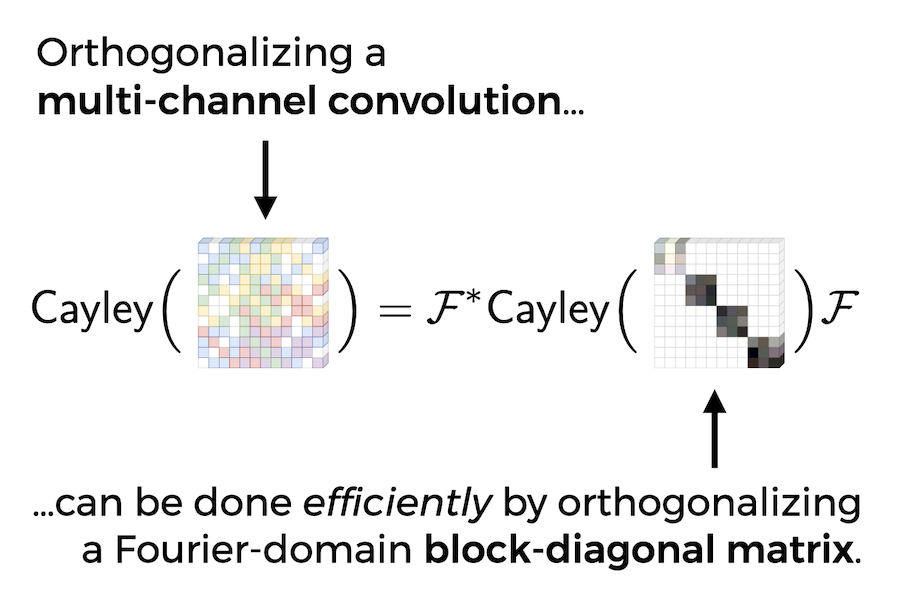

# Orthogonalizing Convolutional Layers with the Cayley Transform

<p>This repository contains implementations and source code to reproduce experiments
for the ICLR 2021 spotlight paper <a href="https://openreview.net/forum?id=Pbj8H_jEHYv">Orthogonalizing Convolutional Layers with the Cayley Transform</a>
by Asher Trockman and Zico Kolter.</p>

<p>
Check out our tutorial on
FFT-based convolutions and how to orthogonalize them
<a href="https://nbviewer.jupyter.org/github/locuslab/orthogonal-convolutions/blob/main/FFT%20Convolutions.ipynb">in this Jupyter notebook</a>.
</p>

*(more information and code coming soon)*

### Getting Started

You can clone this repo using:
```
git clone https://github.com/ashertrockman/private-orthogonal-convolutions --recursive
```
where the `--recursive` is necessary for the submodules.

The most important dependency is **PyTorch >= 1.8**. If you like, you can set up a new conda environment:

```
conda create --name orthoconv python=3.6
conda activate orthoconv
conda install pytorch torchvision torchaudio cudatoolkit=11.1 -c pytorch -c conda-forge
conda install --file requirements.txt
```
